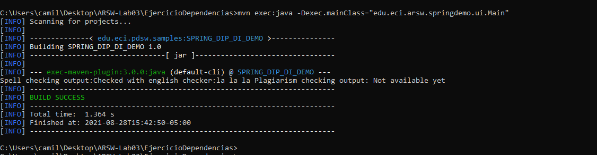
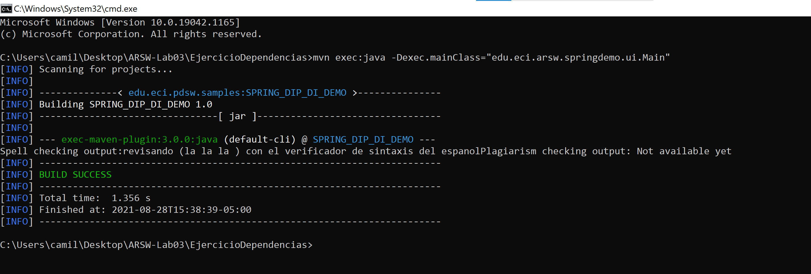

# Escuela Colombiana de Ingeniería
# Arquitecturas de Software - ARSW
### Taller – Principio de Inversión de dependencias, Contenedores Livianos e Inyección de dependencias.

### Compilando el proyecto:
Para compilar el proyecto usaremos el siguiente comando
```
mvn package
```
### Ejecutando el proyecto:
Para hacer uso del proyecto debe haberlo compilado previamente , para ejecutarlo lo hacemos por medio de la consola usando el siguiente comando:
```
mvn exec:java -Dexec.mainClass="edu.eci.arsw.springdemo.ui.Main"
```
Parte I. Ejercicio básico.

Para ilustrar el uso del framework Spring, y el ambiente de desarrollo para el uso del mismo a través de Maven (y NetBeans), se hará la configuración de una aplicación de análisis de textos, que hace uso de un verificador gramatical que requiere de un corrector ortográfico. A dicho verificador gramatical se le inyectará, en tiempo de ejecución, el corrector ortográfico que se requiera (por ahora, hay dos disponibles: inglés y español).

* (1) Abra las fuentes del proyecto en NetBeans.

* (2) Revise el archivo de configuración de Spring ya incluido en el proyecto (src/main/resources). El mismo indica que Spring buscará automáticamente los 'Beans' disponibles en el paquete indicado.

    * El archivo de configuración menciona que se debe de importar el framework Spring, esto para poder realizar las inyecciones correspondientes, para esto lo importa desde el archivo XML que se encuentra en la ruta <i>src/main/resources/newSpringXMLConfig.xml</i>
 
    ``` xml
    <?xml version="1.0" encoding="UTF-8"?>
    <project-shared-configuration>
        <!--
    This file contains additional configuration written by modules in the NetBeans IDE.
    The configuration is intended to be shared among all the users of project and
    therefore it is assumed to be part of version control checkout.
    Without this configuration present, some functionality in the IDE may be limited or fail altogether.
    -->
        <spring-data xmlns="http://www.netbeans.org/ns/spring-data/1">
            <config-files>
                <config-file>src/main/resources/newSpringXMLConfig.xml</config-file>
            </config-files>
            <config-file-groups/>
        </spring-data>
    </project-shared-configuration>
    ```


* (3) Haciendo uso de la [configuración de Spring basada en anotaciones](https://docs.spring.io/spring-boot/docs/current/reference/html/using-boot-spring-beans-and-dependency-injection.html) marque con las anotaciones @Autowired y @Service las dependencias que deben inyectarse, y los 'beans' candidatos a ser inyectadas -respectivamente-:

	* GrammarChecker será un bean, que tiene como dependencia algo de tipo 'SpellChecker'.
	    
	Lo primero que realizaremos es mencionar que GrammarChecker es un servicio, para esto usaremos la etiqueta @Service
	
    ```java
    @Service
    public class GrammarChecker {
        SpellChecker sc;    
        String x; 
    }
    ```
 	
   * EnglishSpellChecker y SpanishSpellChecker son los dos posibles candidatos a ser inyectados. Se debe seleccionar uno, u otro, mas NO ambos (habría conflicto de resolución de dependencias). Por ahora haga que se use EnglishSpellChecker.
   
        * Lo primero que haremos será definir un identificador de tal manera que al momento de realizar la inyección se elija entre 
           <i>SpanishSpellChecker</i> o <i>EnglishSpellChecker</i>, para esto usaremos las etiquetas Component y Qualifier; de forma analoga se realizara para la otra clase
            ``` java
            package edu.eci.arsw.springdemo;
            
            import org.springframework.beans.factory.annotation.Qualifier;
            import org.springframework.stereotype.Component;
            
            @Component
            @Qualifier("english")
            public class EnglishSpellChecker implements SpellChecker {
            
                @Override
                public String checkSpell(String text) {		
                    return "Checked with english checker:"+text;
                }
            
                    
            }
            ```
                
        * Para cumplir con la inyeccion usaremos las etiquetas Autowired (El equivalente Spring a @Inject sería @Autowired) y Qualifier para definir que tipo de instancia necesitamos, en este caso necesitamos el "EnglishSpellChecker" para eso colocaremos "english" ya que fue el identificador denominado para su instancia.
	
            ``` java
            @Service
            public class GrammarChecker {
                
                @Autowired
                @Qualifier("english")
                SpellChecker sc;
            
                String x;
            }
            ```
        <br>
        
        <br> 
* (4)	Haga un programa de prueba, donde se cree una instancia de GrammarChecker mediante Spring, y se haga uso de la misma:

```java
public static void main(String[] args) {
    ApplicationContext ac=new ClassPathXmlApplicationContext("applicationContext.xml");
    GrammarChecker gc=ac.getBean(GrammarChecker.class);
    System.out.println(gc.check("la la la "));
}
```
	
* (5)	Modifique la configuración con anotaciones para que el Bean ‘GrammarChecker‘ ahora haga uso del  la clase SpanishSpellChecker (para que a GrammarChecker se le inyecte EnglishSpellChecker en lugar de  SpanishSpellChecker. Verifique el nuevo resultado.

``` java
@Service
public class GrammarChecker {
    
    @Autowired
    @Qualifier("spanish")
    SpellChecker sc;

    String x;
}
```
<br>

<br>

### Integrantes:

|     Nombre    |     Git         |
|--------------|------------- | 
| Camilo Rincón|[Rincon10](https://github.com/Rincon10 )  |
|Galeano Garzón |[Ersocaut](https://github.com/Ersocaut)   |


### Referencias 
* Spring  [online] Available at: <https://www.arquitecturajava.com/spring-qualifier-utilizando-autowired/> [Accessed 28 August 2021].